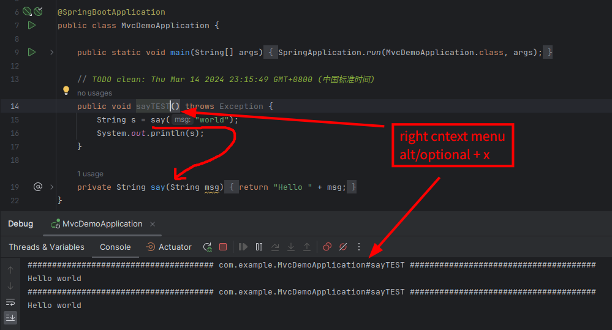

# Spring Bean Invoker

Invoke spring bean method in java project conveniently.

## Use in Idea

- Introduction: [bean-invoker-intellij-plugin/README.md](./bean-invoker-intellij-plugin/README.md)
- Find in [Jetbrains Marketplace](https://plugins.jetbrains.com/plugin/13203-spring-bean-invoker)

## Use in VSCode

- Introduction: [bean-invoker-vscode-plugin/README](./bean-invoker-vscode-plugin/README.md)
- Find in [VSCode Marketplace](https://marketplace.visualstudio.com/items?itemName=newhoo.spring-bean-invoker)

