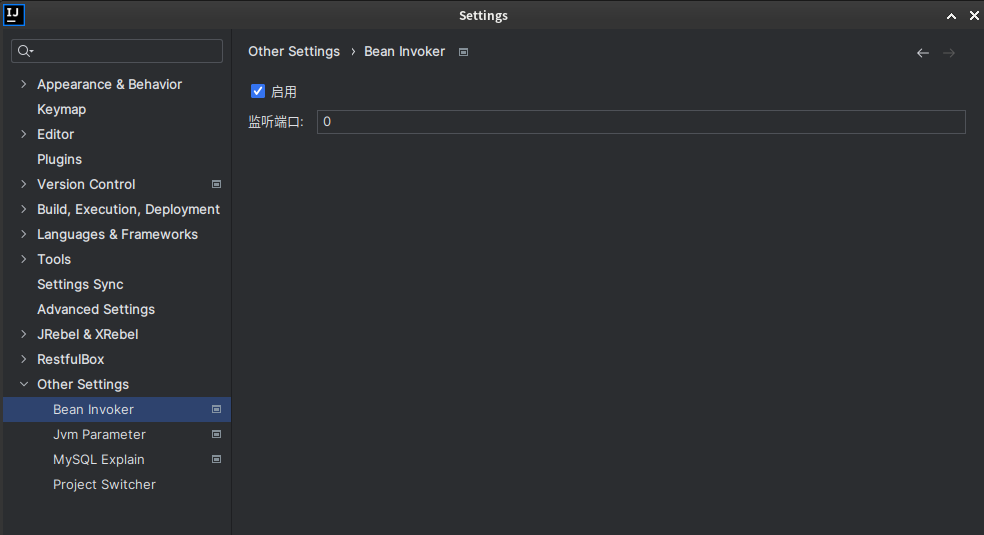

# bean-invoker-intellij-plugin

Invoke spring bean method in java project conveniently. Install via the [Jetbrains Marketplace](https://plugins.jetbrains.com/plugin/13203-spring-bean-invoker).

## Features

Invoke spring bean method conveniently:

- Enable bean invoker in Settings.
- Choose a <b>public method with no parameter</b> in spring beans. On the method, you can invoke other methods as you want !!
- Entrypoint: right click on current method name, and find <kbd>Fast Invoke</kbd>. Default shortcut key is <kbd>option/alt x</kbd>.
- Set port: not required usually. If you get trouble with windows dynamic port, try <a href="https://learn.microsoft.com/en-US/troubleshoot/windows-server/networking/default-dynamic-port-range-tcpip-chang">default-dynamic-port-range-tcpip</a>.
- <b>The most important tip: It works much better with Jrebel plugin.</b>

快速调用 Spring bean 方法，使用：

- 在设置中启用调用
- 源码中选定<b>无参 public 方法</b>，按提示支持自动生成。此方法中，可实现其他有参函数调用!!
- 入口：当前方法名称上右键，找到<kbd>快速调用</kbd>，默认快捷键 <kbd>option/alt x</kbd>
- 指定端口：通常不需要指定，如果遇到 windows 动态端口占用，可参考 <a href="https://learn.microsoft.com/zh-CN/troubleshoot/windows-server/networking/default-dynamic-port-range-tcpip-chang">TCP/IP 默认动态端口范围</a>
- <b>额外说明：搭配 Jrebel 插件，可在运行过程中实现动态加载，使用效果极佳.</b>

## Usage

- Enable in Settings

- Invoke bean method

