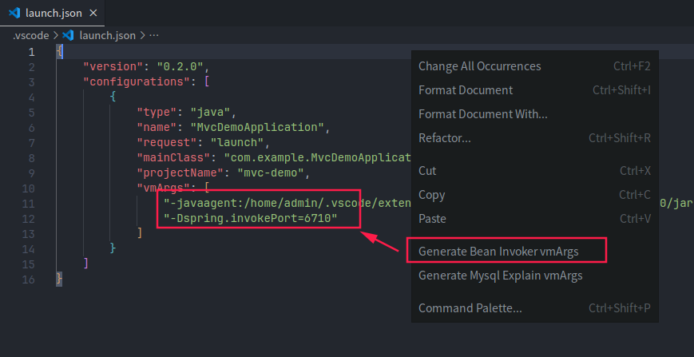
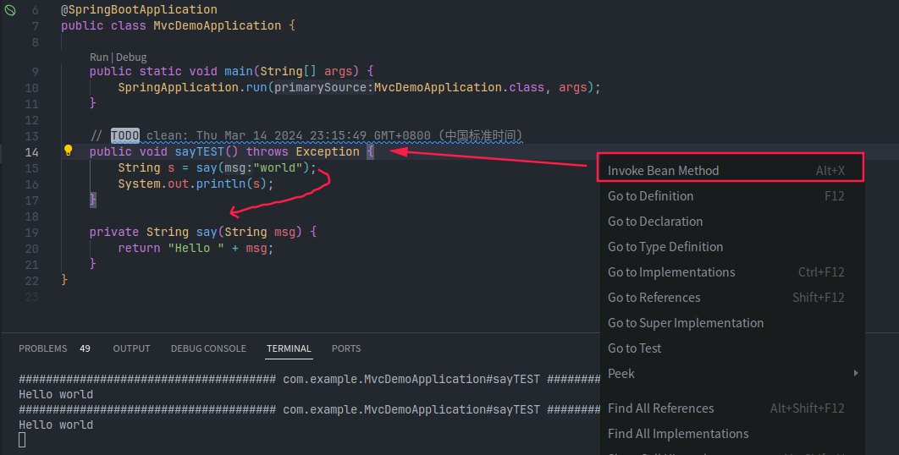

# spring-bean-invoker

Invoke spring bean method in java project conveniently. Install via the [VSCode Marketplace](https://marketplace.visualstudio.com/items?itemName=newhoo.spring-bean-invoker) or see [Installation Instructions](https://code.visualstudio.com/api/working-with-extensions/publishing-extension#packaging-extensions).

## Features

Invoke spring bean method conveniently:

- Firstly add `vmArgs` in `launch.json` file. Click context menu item to generate quickly.
- Need give a `public method with no parameter` in spring bean. On the method, you can invoke other - methods as you want.
- Shortcut: right click on current method line, and click `Invoke Bean Method`. Default shortcut key is `option/alt + x`.
- Set port: not required usually. If you get trouble with windows dynamic port, try [default-dynamic-port-range-tcpip](https://learn.microsoft.com/en-US/troubleshoot/windows-server/networking/default-dynamic-port-range-tcpip-chang).

快速调用 Spring bean 方法，使用：

- 在 `launch.json` 添加 `vmArgs`，可右键快速生成
- 需指定**无参 public 方法**，支持自动生成。此方法中，可实现其他有参函数调用
- 入口：当前方法名称上右键，找到`调用 Bean 方法`，默认快捷键 `option/alt + x`
- 指定端口：通常不需要指定，如果遇到 windows 动态端口占用，可参考 [TCP/IP 默认动态端口范围](https://learn.microsoft.com/zh-CN/troubleshoot/windows-server/networking/default-dynamic-port-range-tcpip-chang)

## Usage

- Generate vmArgs

- Invoke bean method

## Requirements

VSCode 1.85.0 or newer

## Development

Compile before debugging. Debug (F5) while editing `extension.ts` to spawn a VSCode debug instance.
